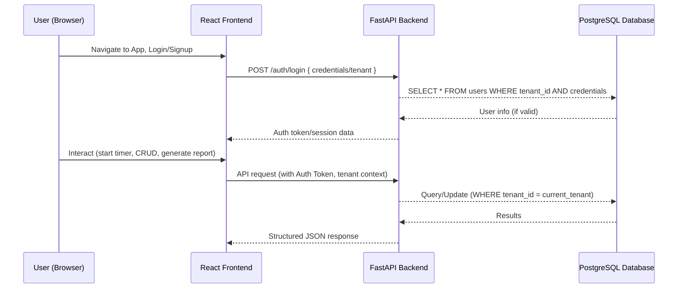
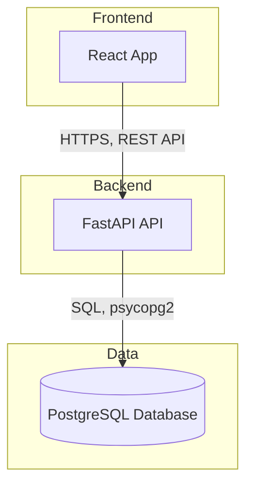

# Architecture Documentation  
## Multitenant Time Tracker Web Application

---

### 1. System Overview

The Multitenant Time Tracker is structured as a modern, cloud-ready, web-based application. It consists of three main components—frontend (React), backend API (FastAPI), and a centralized PostgreSQL database. The system is architected to ensure strong multi-tenant isolation, horizontal scalability, and clean separation of concerns for maintainability and extensibility.

---

### 2. High-Level Architecture Diagram

```mermaid
flowchart LR
    subgraph User_Device["User Device (Browser/Mobile)"]
      FE["React App (Frontend)"]
    end
    FE-->|REST API (HTTPS, JSON)|BE["FastAPI Backend"]
    BE-->|SQL (psycopg2/asyncpg)|DB["PostgreSQL\n(Multi-tenant Schema)"]
    FE-->|Static Assets|FE
```

---

### 3. Component Roles

#### 3.1 Frontend (React)
- Delivers a responsive, minimalist, modern UI accessible via web browsers on any device.
- Handles authentication flows, multi-tenant login and selection, time tracking interfaces, dashboards, and reporting widgets.
- Communicates securely with the FastAPI backend through REST API calls using HTTPS and JWT/session-based authentication.

#### 3.2 Backend API (FastAPI, Python)
- Central point for business logic and data orchestration.
- Exposes all application functionality via RESTful endpoints (authentication, CRUD, time entries, tags, reports, etc.).
- Enforces multi-tenancy on every operation, scoping all data queries and mutations strictly to the authenticated user's tenant.
- Interfaces with the PostgreSQL database via an ORM or direct SQL, ensuring all queries are tenant-isolated.

#### 3.3 Database (PostgreSQL)
- Stores all persistent data: users, tenants, clients, projects, work sessions, technologies, etc.
- Database schema is explicitly designed for multi-tenancy (see below).
- May use connection/user per app instance, but tenant is always a required column in all relational data.

---

### 4. Detailed Data Flow & Authentication



---

### 5. Multi-Tenancy Implementation

- **Tenant Definition:** Each user belongs to a tenant (organization/group). Every table with business data includes a `tenant_id` column.
- **Data Isolation:** All backend queries are parameterized to include the current user's `tenant_id`, enforced at the ORM/service/business-logic layer.
- **Authentication:** On successful authentication, a user's tenant context is securely embedded in their session or token.
- **No Data Leakage:** There is no way to access or mutate other tenants' data—even via API parameters—due to strict multi-tenant constraints in the backend.

#### Example: Multi-Tenant Table Schema
```sql
CREATE TABLE projects (
    id SERIAL PRIMARY KEY,
    tenant_id UUID NOT NULL,
    name TEXT NOT NULL,
    description TEXT,
    -- further columns omitted
    FOREIGN KEY (tenant_id) REFERENCES tenants(id)
);
```
Every query to this table in the backend is always filtered using `WHERE tenant_id = :current_tenant_id`.

---

### 6. API/Interface Contracts

#### REST API (FastAPI)
- **Endpoints:** Structured as `/api/{resource}` with REST semantics—e.g., `/api/projects`, `/api/clients`, `/api/entries`, etc.
- **Authentication:** JWT or session cookie (HTTP Only), must be presented on each request.
- **Tenant Context:** Either included in the JWT/session or as a required header; backend enforces correct scoping.
- **Input/Output Format:** All endpoints accept and return JSON. Example endpoints:

```plaintext
POST   /api/auth/login
POST   /api/auth/logout
GET    /api/projects        (returns only tenant's projects)
POST   /api/time_entries    (creates time entry for current tenant)
GET    /api/reports         (filtered to tenant, various aggregations)
```

#### Database Interface (PostgreSQL)
- Accessed by backend only; not directly exposed.
- All multi-tenant tables include `tenant_id` for row-level security.

---

### 7. Container and Deployment Model



- **Frontend**: Static assets served via CDN or node server, connects over HTTPS to backend.
- **Backend**: Exposes API on a protected network or as a public HTTPS endpoint.
- **Database**: Protected access, only backend connections permitted. May be hosted in managed DB service or container.
- **Scaling**: Stateless frontend/backend containers can be scaled horizontally. Tenant isolation is preserved at all layers.

---

### 8. Technical Flows

#### Typical User Flow: Tracking Work Time
1. User logs in (chooses/selects tenant).
2. User starts a timer for a project and technology.  
   (Frontend POSTs to backend, backend creates new entry in time_entries scoped to the user & tenant.)
3. On stopping timer, entry is finalized and saved.
4. Dashboard and reports are rendered by requesting APIs that aggregate/filter by tenant.

#### Reporting/Data Export
- Frontend sends filter request (e.g., for a certain client/project/date range).
- Backend queries only that tenant's relevant tables/data.
- Results are returned and exported as CSV/Excel if needed.

#### Multi-Tenant Admin Use (future extensibility)
- Admins can only see and manage their own tenant's users/projects.
- All administrative dashboards are segregated by tenant context.

---

### 9. Security & Compliance

- Strict backend enforcement of tenant-data isolation.
- Secure user authentication, encryption for sensitive data at rest and in transit.
- No direct database access from frontend or client devices.
- Cross-Origin Resource Sharing (CORS) enabled as per backend configuration to support the web SPA.

---

### 10. Extensibility & Maintainability

- The layered architecture (frontend, backend, data) allows for easy updates to UI or backend logic.
- Adding new resources (e.g., more metadata, reporting types) requires extensions at the API and database model without breaking tenancy.
- API versioning to be supported in the backend for future enhancements.

---

*End of Architecture Documentation*
