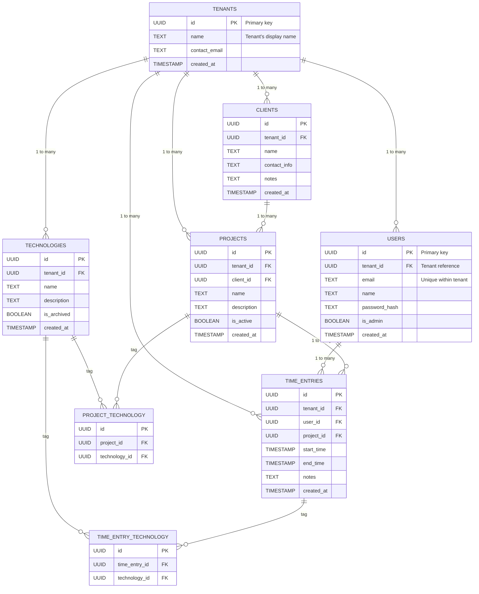

# Database Schema Documentation
## Multitenant Time Tracker

---

### Overview

The Multitenant Time Tracker uses a relational PostgreSQL schema designed for robust multi-tenancy. All business tables are scoped by `tenant_id`, ensuring strict data isolation for each organization/group. Every major entity—users, clients, projects, technologies, sessions/time entries—is designed with multi-tenancy and extensibility in mind.

---

### Entity-Relationship Diagram (ERD)



---

### Table Summaries

#### tenants
- **id (UUID PK):** Unique identifier for each tenant (organization/workgroup).
- **name:** Human-friendly name for tenant.
- **contact_email:** (optional) Admin/primary contact for tenant.
- **created_at:** Automatic creation date.

#### users
- **id (UUID PK):** Unique per user.
- **tenant_id (FK):** References tenants.id. All users are scoped.
- **email:** Unique for each user *within the tenant* (enforced by composite unique (tenant_id, email)).
- **name:** User's full name.
- **password_hash:** Hashed password.
- **is_admin:** (bool) Tenant-level admin privileges.
- **created_at:** Date added.

#### clients
- **id (UUID PK)**
- **tenant_id (FK)**
- **name:** Client organization/individual.
- **contact_info:** Email/Phone or JSON metadata.
- **notes:** Longform notes.
- **created_at**

#### projects
- **id (UUID PK)**
- **tenant_id (FK):** All projects belong to a tenant.
- **client_id (FK):** Client for the project (also must belong to same tenant).
- **name**
- **description**
- **is_active:** (bool) Archival for soft deletes.
- **created_at**

#### technologies
- **id (UUID PK)**
- **tenant_id (FK)**
- **name:** E.g., "React", "PostgreSQL", etc.
- **description**
- **is_archived:** (bool)
- **created_at**

#### time_entries
- **id (UUID PK)**
- **tenant_id (FK):** Multitenant enforcement.
- **user_id (FK):** User who created the timespan; must belong to same tenant.
- **project_id (FK)**
- **start_time, end_time:** When session began/finished.
- **notes:** User-optional description.
- **created_at**

#### time_entry_technology
- **id (UUID PK)**
- **time_entry_id (FK):** Maps entries to technologies used.
- **technology_id (FK)**

#### project_technology
- **id (UUID PK)**
- **project_id (FK)**
- **technology_id (FK)**

---

### Foreign Key Relationships

- Most tables reference `tenant_id` as a foreign key to `tenants(id)`. This ensures strict multi-tenant separation.
- "users" references "tenants" via `tenant_id`.
- "projects" references both "tenants" and "clients".
- "clients", "projects", "technologies", and "time_entries" are all owned by a tenant.
- Join tables link many-to-many relationships between projects/technologies and sessions/technologies.

---

### Indexes and Uniqueness

- **Primary Key Indexes:** All tables have a PK on `id`.
- **Tenant-scoped Uniqueness:** For example, the combination `(tenant_id, email)` in "users" is unique (enforced at DB level) to avoid cross-tenant duplication.
- **Foreign Keys:** Enforced to ensure referential integrity with cascading deletes minimized—usually set to restrict or set null—to prevent accidental data loss across tenants.
- **Additional Indexes:** Recommended for `(tenant_id, name)` in projects, clients, technologies for efficient search/autocomplete, and on `(tenant_id, created_at)` for dashboard queries.

---

### Multi-Tenancy Enforcement

Row-level data separation is maintained by including `tenant_id` as a NOT NULL foreign key on every business data table. Backend APIs enforce that all queries and mutations are always pre-filtered or post-checked for the authenticated user's tenant; no data is ever accessed or mutated outside the current tenant's scope. The database schema is designed to enforce this via both database constraints (foreign keys, unique indexes) and access patterns.

Example table creation pattern:

```sql
CREATE TABLE projects (
  id UUID PRIMARY KEY DEFAULT gen_random_uuid(),
  tenant_id UUID NOT NULL REFERENCES tenants(id),
  client_id UUID REFERENCES clients(id),
  name TEXT NOT NULL,
  description TEXT,
  is_active BOOLEAN DEFAULT TRUE,
  created_at TIMESTAMP DEFAULT now(),
  UNIQUE(tenant_id, name)
);
```
All API access is always of the pattern:

```sql
SELECT * FROM projects WHERE tenant_id = :current_tenant_id;
```

---

### Extensibility

This schema supports adding further metadata or tags (e.g., extra reporting, audit logs) by including the `tenant_id` column for every major new table. All future business entities are constructed using the same multi-tenant enforcement principle.

---

### Notes

- All timestamps use UTC, set in the backend API.
- IDs are in UUID format for global uniqueness.
- **No soft deletion by default**—archiving/active flags are used for most entities.

---

*This documentation covers the initial database schema for the multitenant time tracker, referencing current requirements and architectural choices. Future migrations will follow the multi-tenant-first model described here.*

