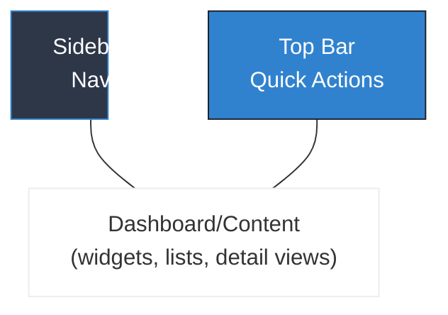
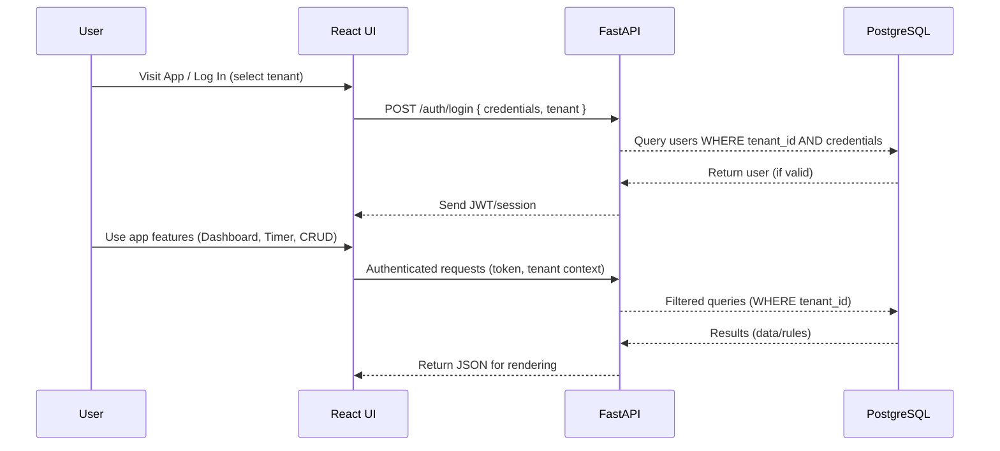
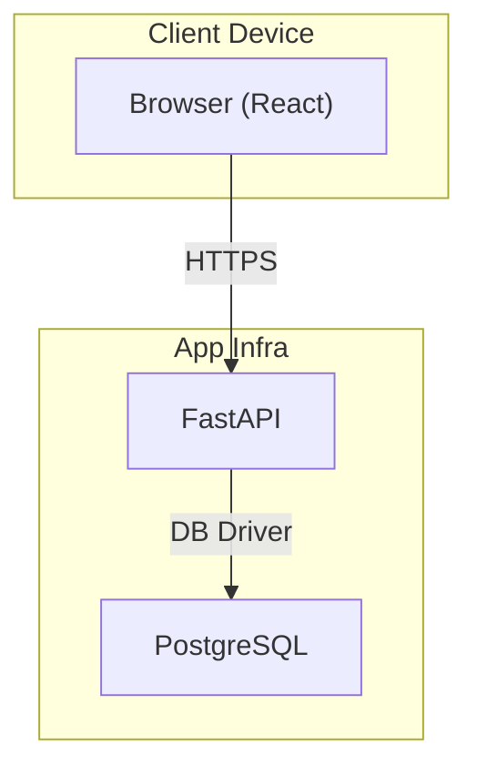

# Multitenant Time Tracker Design Documentation

## 1. Introduction

This document describes the overall user interface (UI) and system architecture of the Multitenant Time Tracker web application. It is intended for both technical and non-technical stakeholders and uses diagrams and clear narrative to explain layouts, components, data flow, deployment, and the architectural choices underpinning a modern, secure, and user-friendly multi-tenant product.

---

## 2. User Interface Design

### 2.1 Visual Style and Principles

- **Minimalist, Modern, Clean**: The application employs a whitespace-rich, uncluttered style, using crisp typography and a controlled palette for focus and accessibility.
- **Responsive and Accessible**: All design elements adapt fluidly to desktop, tablet, and mobile; color contrast and font sizes meet accessibility standards.
- **Theme Auto-adaptation**: Supports automatic light/dark theme based on user or system settings, with gentle color transitions.

#### Brand Colors (from CSS):

- Primary dark: `#1a202c`
- Secondary: `#2d3748`
- Accent: `#3182ce`
- Contrast and highlights use a light blue `#61dafb` or soft backgrounds for callouts.

### 2.2 Main Layout (Desktop & Mobile)

#### Structure

- **Sidebar Navigation**: Fixed to the left (collapsible on mobile), houses icons/links for Dashboard, Clients, Projects, Time Entries, Reports, and Profile/Settings.
- **Top Bar**: Contains quick actions (Start Timer, Add Project/Client), current user/tenant info, and theme switcher.
- **Dashboard Area**: Main content region, displaying widgets, charts, and lists.

#### Visual Layout Diagram



##### Mobile

- Sidebar collapses into a hamburger menu.
- Top Bar stays fixed at the top.
- Dashboard rearranges widgets into a vertical scroll.

### 2.3 Core Components

- **Sidebar**: Navigation links/icons; tooltip labels, current section highlight.
- **Dashboard Widgets**: 
  - *Summary Cards*: Hours tracked (by client/project/date/tech).
  - *Recent Activity List*: List of sessions or changes.
  - *Quick Chart*: Visualizes breakdown (pie/bar) by category.
- **Timer Button**: Large CTA button to start/stop timer (floating or toolbar).
- **Entity Tables/Lists**: Simple sortable tables (Projects, Clients, Sessions).
- **Forms**: Modal dialogs for Add/Edit operations; optimized for keyboard and touch.
- **Theme Toggle**: Accessible, high-contrast toggle (🌙/☀️) for light/dark mode.

### 2.4 Example Widget and Theme

- All interactive components follow the color & spacing scheme set in `App.css`.
- Example (CSS from App.css):

```css
.theme-toggle {
  background-color: var(--button-bg);
  color: var(--button-text);
  border-radius: 8px;
}
```

> *Note: All components follow accessibility guidelines for color, focus rings, ARIA labeling, and tab order.*  

---

## 3. System Architecture

### 3.1 High-Level Component Map

```mermaid
flowchart TD
    FE["React Frontend"]
    BE["FastAPI Backend API"]
    DB["PostgreSQL Database"]
    FE-->|REST API (HTTPS, JSON)|BE
    BE-->|SQL (psycopg2/asyncpg)|DB
```

#### Description

- **Frontend (React):** Provides the application UI, handles authentication, session, and all user actions. Sends API calls via HTTPS to backend.
- **Backend (FastAPI):** Serves all REST API endpoints, manages business logic, implements authentication and tenant isolation, enforces multi-tenancy at every operation.
- **Database (PostgreSQL):** Stores persistent data, all tables use a `tenant_id` column, maintaining strict row-level isolation.

### 3.2 Data Flow and Integrations

#### Data & Authentication: Sequence Example



#### Integration Points

- **React <-> FastAPI:** API endpoint contract—stateless REST API, JSON req/resp, auth via JWT/session.
- **FastAPI <-> PostgreSQL:** ORM/direct SQL, always with `tenant_id`, never exposing raw DB externally.

---

### 3.3 Deployment Topology



- **Scaling**: Frontend and backend are stateless, can scale horizontally (add more containers/VMs as needed).
- **Security**: Only backend may connect to DB. All requests to backend authenticated and authorized per tenant.

---

## 4. Architectural Patterns and Practices

- **Layered Architecture**: Separation of concerns between UI, API, and data. Ensures maintainability and simplifies feature development.
- **RESTful API**: All actions follow REST principles—CRUD mapped to endpoints, statelessness, consistent resource-based paths.
- **Multi-Tenant Row-Level Security**: Every business data table includes a `tenant_id`, with backend query enforcement.
- **Responsive, Accessible Design**: Themeable, accessible UI foundation—with easy re-theming and high usability.
- **API Versioning Ready**: Paths to version API endpoints for future large-scale changes or new integrations.

---

## 5. Change Management / Extensibility

- **Adding Features**: New widgets/APIs can be added to UI/backend with minor changes, thanks to clear separation and modularity.
- **Theming or Branding**: Color palette and layout governed by a few CSS variables, so visual overhaul is simple.
- **Integrations**: System prepared for future integrations (CSV/Excel, further reporting, or third-party services) with minimal change to core.
- **Security Hardening**: Further access control rules, two-factor authentication, or additional audit trail logic can be implemented at backend.

---

## 6. Diagrams Summary

- High-level architecture and data flow mermaid diagrams included above.
- All diagrams are markdown-compatible and describe current implemented structure (React/FASTAPI/Postgres) and core data paths; extensibility scenarios are aligned with these references.

---

## 7. References

- See also [architecture.md](architecture.md) for system-focused API/table details and [product-requirements.md](product-requirements.md) for user stories, acceptance, and PRD.

---

*End of UI & Architecture Design Documentation*
